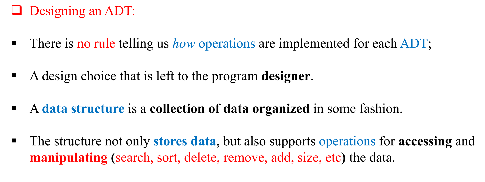
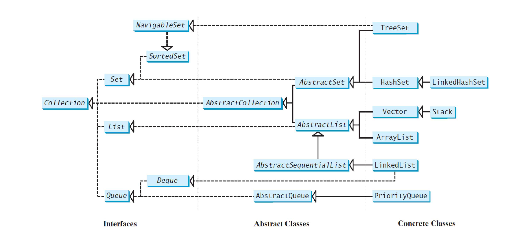
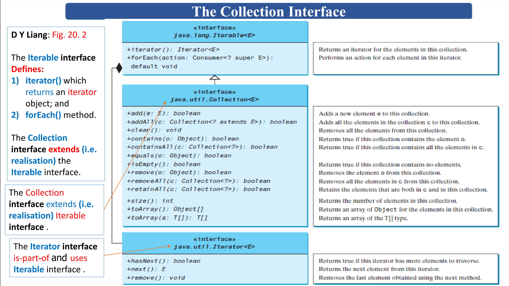
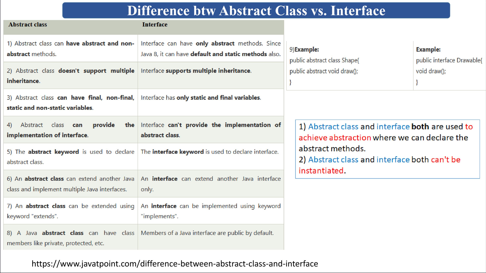
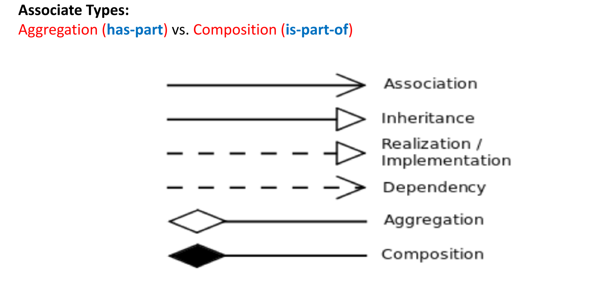
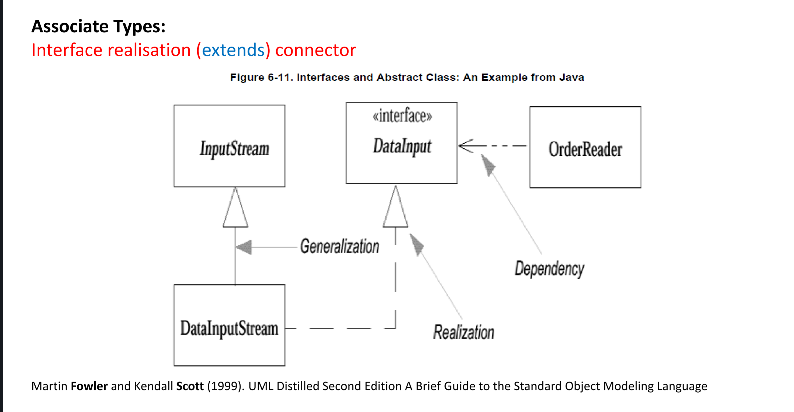
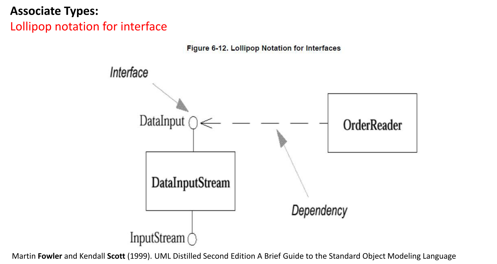
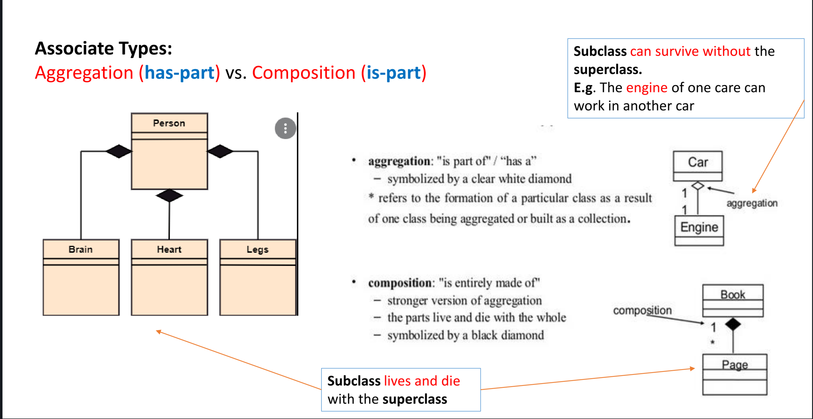

# DataStructure
All code written in CPS 2232 (DATA STRUCTURES) @Kean University

[Preparation For Data Structure][pre]    
[Generics][generics]  
[Hashing Technique][hash]  
[*Sorting*][sa]

## Abstract Data Type (ADT)
An abstract data type (ADT) is a set of objects such as `lists`, `sets`, `arrays`, `queues`, `graphs`, and their operations, can 
be viewed as ADTs, just as integers, real, and boolean are data types. together with a set of operations on the objects. The set of operations defines the interface of the ADT. The implementation of the operations defines the implementation of the ADT. The implementation of an ADT is called a data structure.

ADTs are mathematical abstractions consists of `data type` and `operations` on the data type. 

Modern programming languages e.g. Java, C, C++, python, etc., supports a form of ADTs when a class is used as a type, like… 

int x; // primitive integer type  
GenericStack stack; // class type declaration

In Java, the `Collection interface` defines the common operations for  
[lists](./src/list), store an ordered collection of elements.    
vectors,       
[stacks](./src/stack), store objects that are processed in a last-in, first-out fashion (LIFO).  
[queues](./src/queue), store objects that are processed in a first-in, first-out fashion (FIFO). 
priority queues, store objects that are processed in the order of their priorities     
and [sets](./src/set), store a group of nonduplicate elements.   

The Java Collections Framework supports two types of **containers**:   
■■ One for storing a collection of elements is simply called a _collection_.  
■■ The other, for storing `key/value pairs`, is called a _map_.

The AbstractCollection class provides partial implementation for the Collection interface.
It implements all the methods in Collection except the add(), size(), and iterator() methods.  
And these are implemented in the concrete subclasses 

  

## UML
  

[sa]: ./src/sort
[pre]: ./src/preparation   
[hash]: ./src/hashing   
[generics]: ./src/generics