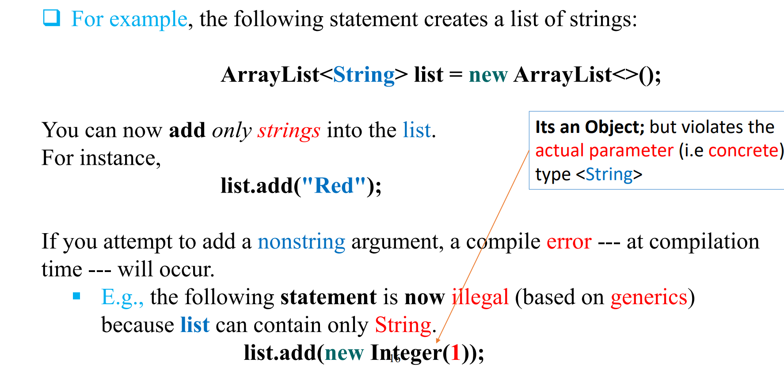
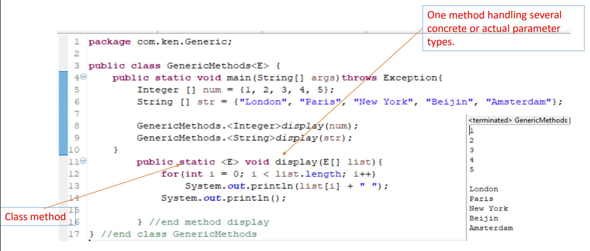
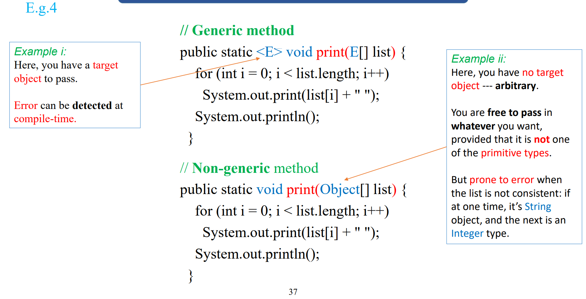
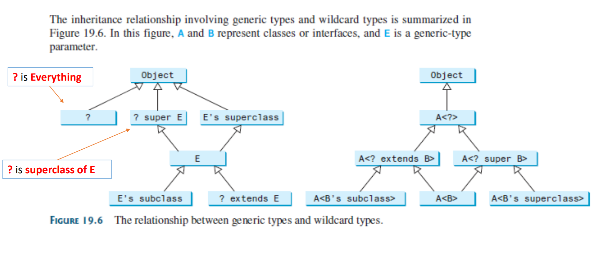
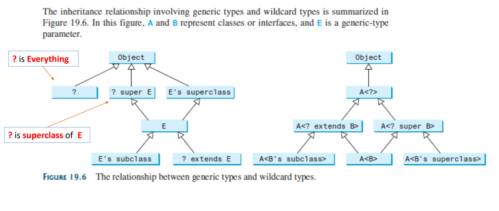
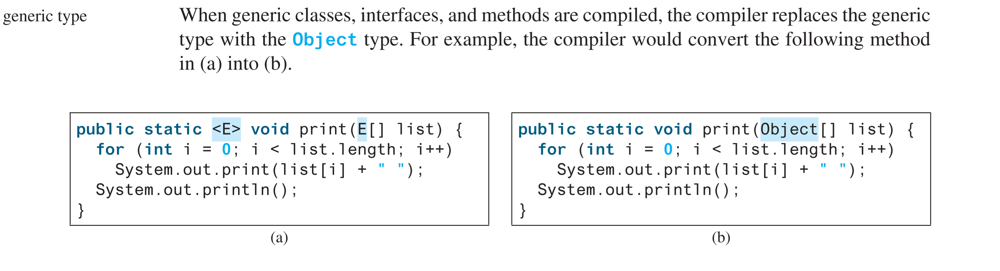
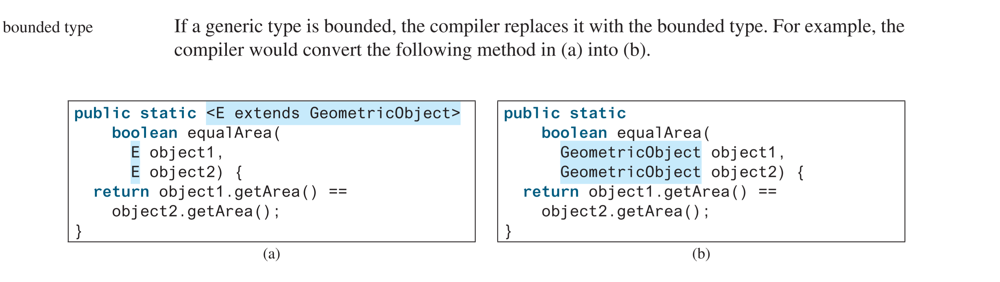
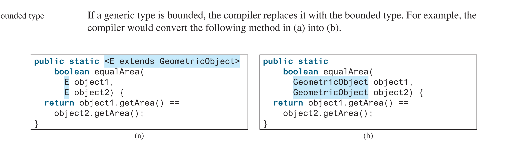
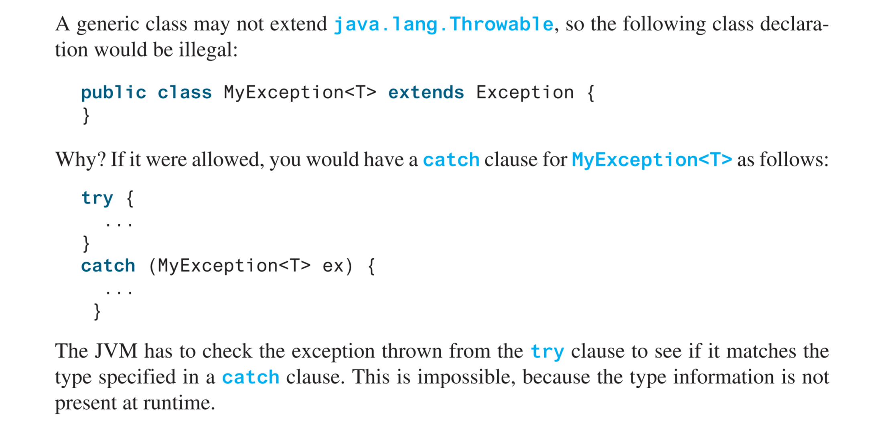

# Generics 
_Generics_ is the capability to **_parameterize types_**: use of characters to represent **object
or reference types** (not primitive type), which define a class or a method with generic types that can be
substituted (using concrete types) by the compiler.  

This can be on class headers, data fields, method headers
```java
    public class Stack<E>{//class header
    int pointer;
    int E;//data filed
    
    public static <E> int getPointer() {//method header for static method
    }
    
   public static <E> E doSomething(){
        
  }

  public static void add(E e){ // markdown did not show bug here :<  
        //this method will throw an error, if you did not declare its generic type after static
        //clue: static methods are class methods 
  }
  
      
    
}
```

generics in class header and method header are different [see](./GenericNumbers.java)   
> that is why the following throw an error  
> public &lt;E&gt; E returned(){  
> }
> 

A generic class or method permits you to specify allowable types of
objects that the class or method can work with.

* E - Element (used extensively by the Java Collections Framework)  
* K - Key  
* N - Number
* T - Type
* V - Value
* S,U,V etc. - 2nd, 3rd, 4th types  
  
Benefits of Generics?
  * The key benefit of generics is to enable errors to be detected at` compile
  time` rather than at `runtime`. 
  * A generic class or method permits you to specify `allowable types` of objects
  that the class or method can work with 
  * If you attempt to use the class or method with an incompatible object, a
  compile error occurs.
   
A generic type &lt;E&gt; can be used to define generic class or interface.  
A generic type < E > also allow the definition of a generic method.  
A concrete type (or actual parameter type) must be specified when using the class to create an object or using the class
or interface to declare a reference
variable.   
The concrete type must be a `reference type`, namely:
_String_, _Wrapper classes_ e.g. Integer, Double, etc., _User defined type_ e.g. class Student  


## Raw Types and Backward Compatibility 
A generic class or interface used without specifying a concrete type, called a
raw type, enables backward compatibility with earlier versions of Java   
[see ray type here](https://docs.oracle.com/javase/tutorial/java/generics/rawTypes.html)
> GenericStack stack = new GenericStack();


## Unbounded or Bounded Generic Type 

We bound the data types (class, interface or object) that are accepted by a generic class or
method that it should be a subtype of another class (e.g. super class), which restrict the types that can be used as type
arguments in a parameterized type

* extends upperBounded (limit)
* super lowerBounded

[See more about bounded generics](https://docs.oracle.com/javase/tutorial/java/generics/bounded.html)
[Compiler does not know what type E(<E extends GeometricObject>) is in compile time, see this example](./BoundedTypeDemo.java)

## Wildcard Generic Type
Wildcard ?  
To limit the data types that can be stored in a list that can be passed to a method, we used
bounded generics to specify the range  
Question mark (?) is the wildcard symbol in generics and represent an unknown type. 

> Integer is a subtype of Number, but GenericStack<Integer> is not a subtype of GenericStack<Number>. To circumvent this problem, use wildcard generic types. A wildcard generic type has three forms: ?, ? extends T, and ? super T, where T is a
generic type.

We CANNOT use wildcards &lt;?&gt; while  
i) invoking a generic method, or  
ii) instantiating a generic class.


## Erasure and Restrictions on Generics 
The information on generics is used by the compiler but is not available at runtime.
This is called type erasure  
`type erasure`   
The compiler uses the generic-type information to compile the code, but erases it afterward. Thus, the generic information is not available at runtime. This approach enables the generic code to be backward
compatible with the legacy code that uses raw types.  
The generics are present at compile time. Once the compiler confirms that a generic type is used safely, it converts the generic type to a raw type.


It is important to note a generic class is shared by all its instances regardless of its actual concrete type. Suppose list1 and list2 are created as follows:  
    
    ArrayList<String> list1 = new ArrayList<>();
    ArrayList<Integer> list2 = new ArrayList<>();
Although ArrayList<String> and ArrayList<Integer> are two types at compile time, only one ArrayList class is loaded into the JVM at runtime. list1 and list2 are both
instances of ArrayList, so the following statements display true:

    System.out.println(list1 instanceof ArrayList); 
    System.out.println(list2 instanceof ArrayList);
However, the expression list1 instanceof ArrayList<String> is wrong. Since ArrayList<String> is not stored as a separate class in the JVM, using it at runtime makes no sense.
Because generic types are erased at runtime, there are certain restrictions on how generic
types can be used. Here are some of the restrictions:  
*Restriction 1: Cannot Use new E()*  
The reason is new E() is executed at runtime, but the generic type E is not available at runtime.  
*Restriction 2: Cannot Use new E[]*  
You can circumvent this limitation by creating an array of the Object type then casting it to E[], as follows:
E[] elements = (E[])new Object[capacity];
However, casting to (E[]) causes an unchecked compile warning. The warning occurs because the compiler is not certain that casting will succeed at runtime. For example, if E is String and new Object[] is an array of Integer objects, (String[])(new Object[]) will cause a ClassCastException. This type of compile warning is a limitation of Java generics and is unavoidable.
Generic array creation using a generic class is not allowed, either. For example, the fol-
lowing code is wrong:
*Restriction 3: A Generic Type Parameter of a Class Is Not Allowed in a Static Context*  
Since all instances of a generic class have the same runtime class, the static variables and methods of a generic class are shared by all its instances. Therefore, it is illegal to refer to a
generic-type parameter for a class in a static method, field, or initializer. For example, the following code is illegal:

```java
public class Test<E> { public static void m(E o1) { // Illegal }
  public static E o1; // Illegal
  static { 
      E o2; // Illegal
  }
}
````
*Restriction 4: Exception Classes Cannot Be Generic*  
