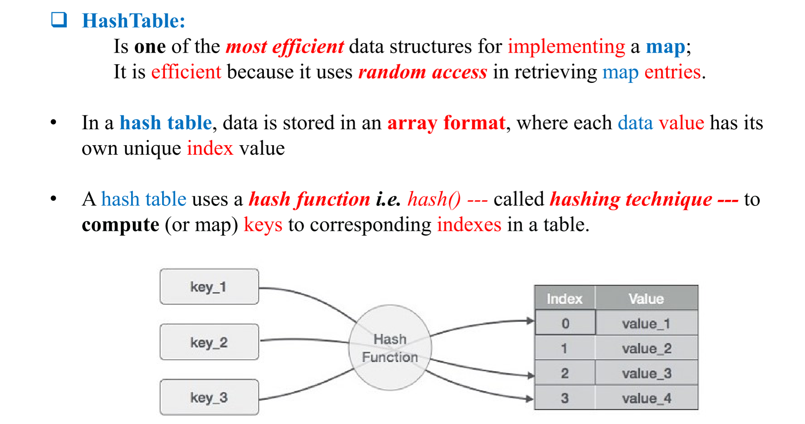
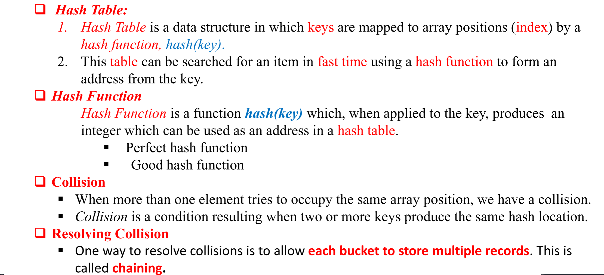
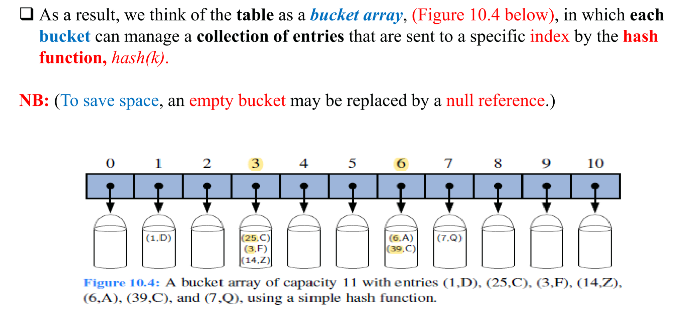
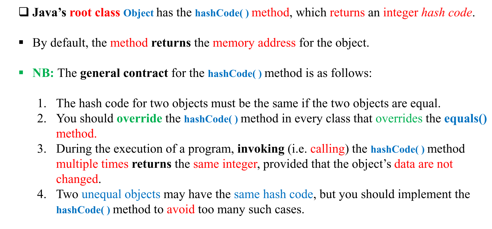
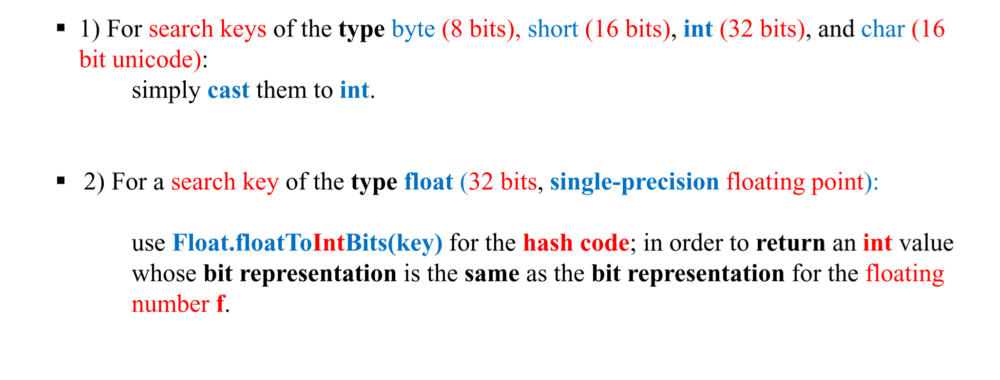
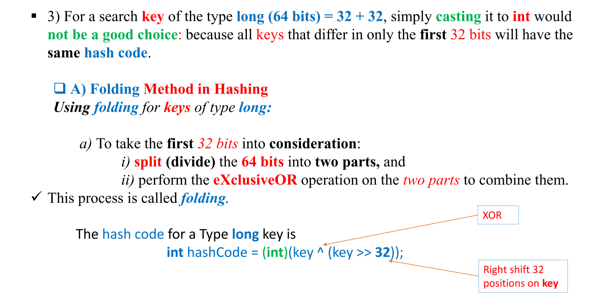

# Hasing
- Hashing uses a data structure called a hash table.
- Although hash tables provide fast insertion, deletion, and retrieval, but operations that involve searching, such as finding the minimum or
  maximum value, are not performed very quickly.
- Hashing is a technique that is used to uniquely identify a specific object from a group of similar objects.
-  hash table, that will increase our efficiency to O(1) , or constant time.
Hashing is the technique (process) of mapping large amount of data item to a smaller table called (hash table) with the 
help of a hashing function.
  

  
   

Drawbacks 
1. First, the space used is proportional to N.
   Thus, if Nis much larger than the number of entries actually present in the map, we have a waste of space.
2. The second draw back is that keys are required to be integers given in the range
   [0, N − 1], which is often not the case.

1. Division function :  h(K)= K mod NSize.  It is best if NSize is a prime number.  
Advantages:   
- simple   
- useful if we don't know much about the keys

2. Extraction
   - Is to use only a part of the key to compute the hash value/ address/ index.
   - For example, if the key is 123456789, we can use the last 3 digits and first 3 digits 789123 as the hash value.
3. Folding
   - Divide the key into several parts of equal size (the last part may not be equal to the others).
   - Add the parts together to give the hash value.
   - For example, if the key is 123456789, we can divide it into 123 and 456789, and add them together to give the hash value 456912.
   - If excess digits are present, we can modulo the hash value by the table size to give the final hash value.
1) shift folding
    - Similar to folding, but we shift the parts before adding them together.
    - For example, if the key is 123456789, we can divide it into 123 and 456789, and shift the second part to give 789456, and add them together to give the hash value 912579.
    - If excess digits are present, we can modulo the hash value by the table size to give the final hash value.
2) Boundary folding
    - Similar to shift folding, but except that every other part is written backwards
    - For example, if the key is 123456789123, we can divide it into 123 456 789,123 and shift it to give 123 654 789,321, and add them together to give the hash value.
    - If excess digits are present, we can modulo the hash value by the table size to give the final hash value.   
4. Mid-square
   - Square the key, and extract some portion of the resulting digits.
   - For example, if the key is 123456789, we can square it to give (123456789)^2 = 15241578750190521, and extract the middle 3 digits 787 as the hash value.
   - This method is not very good if the key is small, as the middle digits may not be well distributed.

