What is analysis?   
The process of breaking down a whole (system, block of knowledge, etc.) into smaller parts or steps and then reworking how each part
contributes to the whole.  

The Big O is an approach that measures the efficiency of (how good) an algorithm.   
 Big O takes into consideration the size of inputs n to determine the efficiency of an
algorithm.

The efficiency or running time of an algorithm is stated as a function, f(n), that relates: 
1. input length to the number of steps (known as time complexity); or
2. size of memory (known as space complexity).`

Big O commonly known as computational time complexities, T(n), is not a measure of time in seconds, or minutes.  
Thus, the Big O is a technique that measures the growth rate or order of operation (or
magnitude) of an algorithm w.r.t. to the number of elements or size of inputs n.
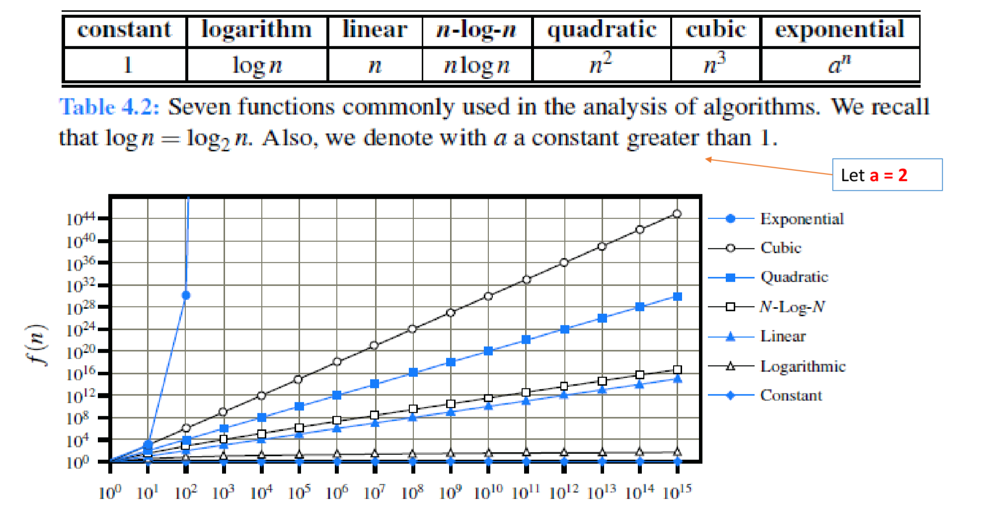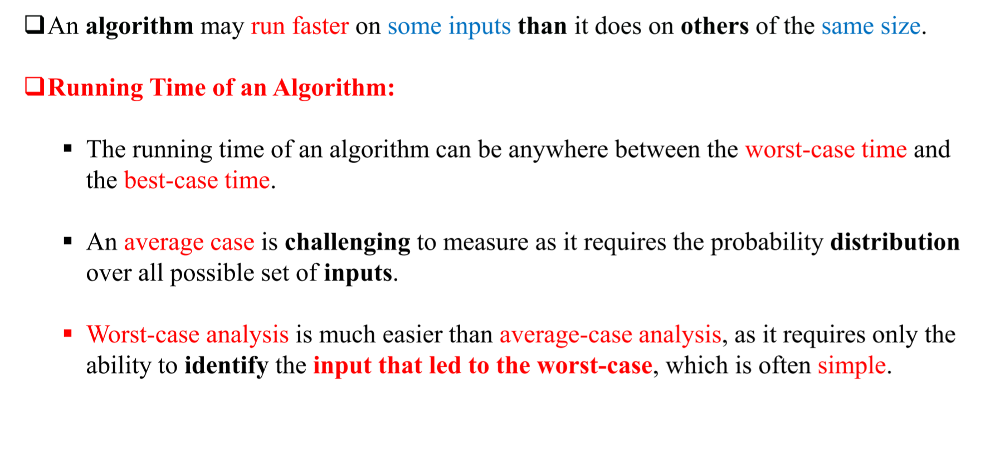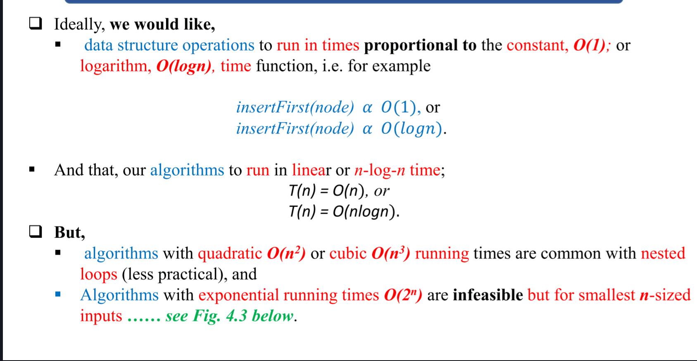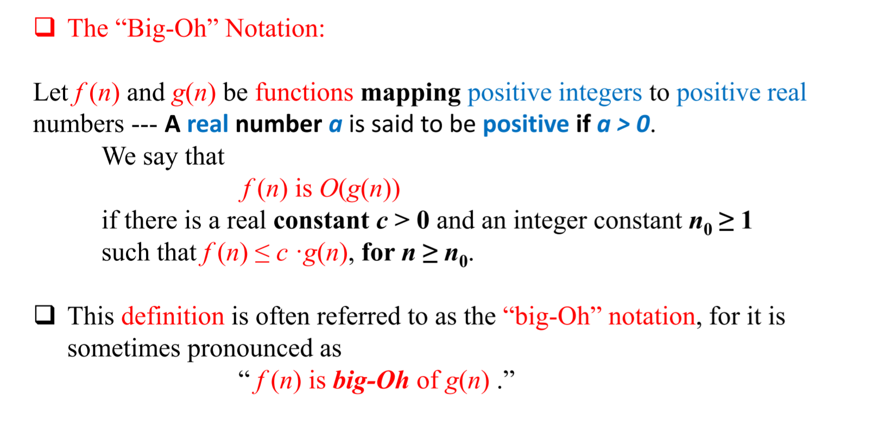
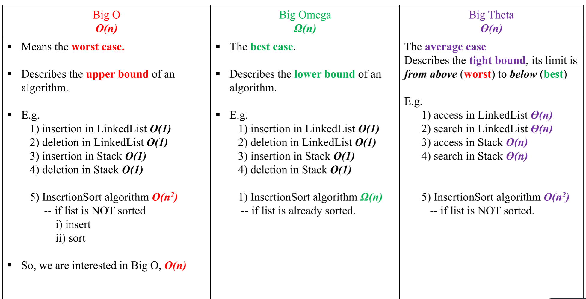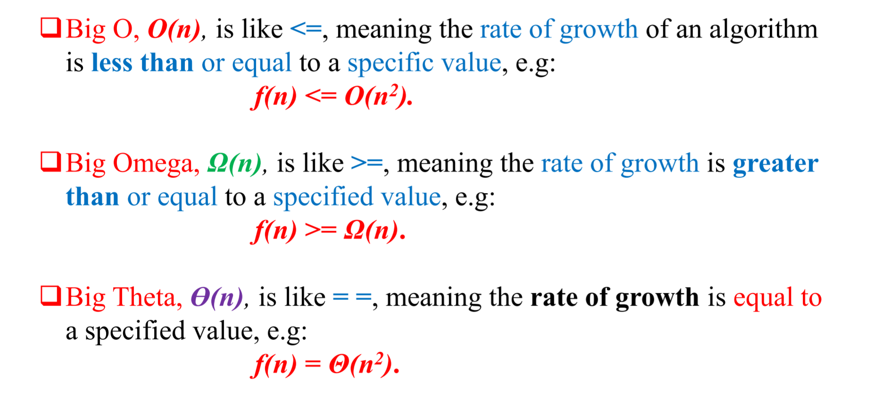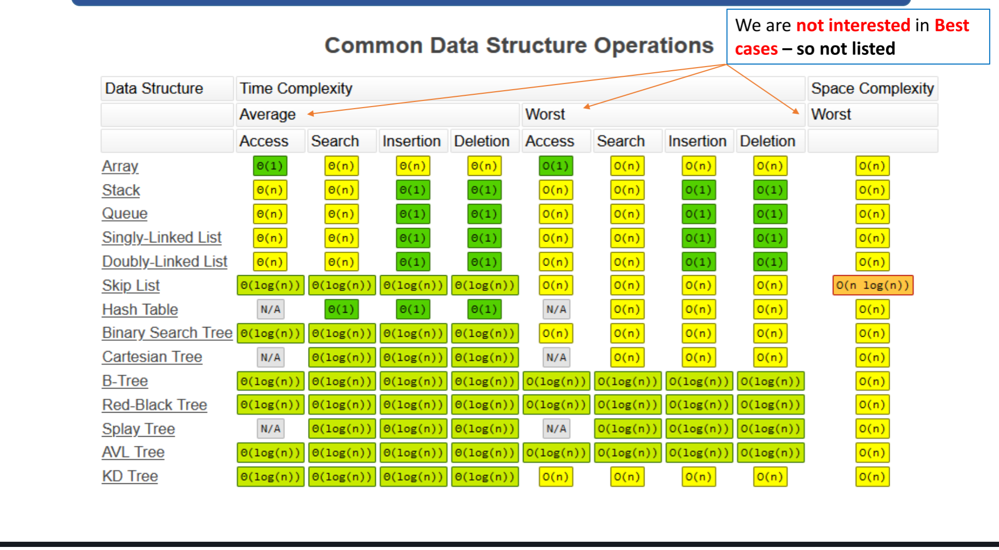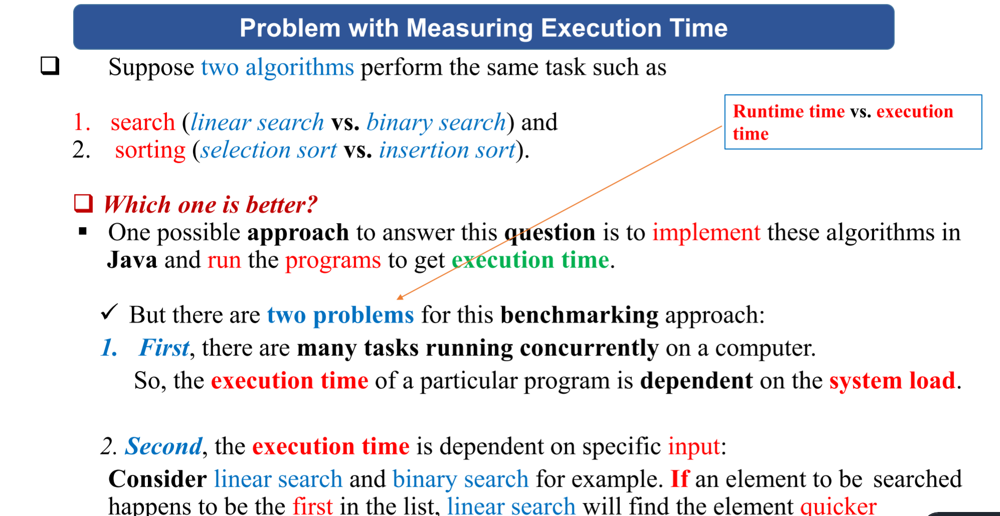

It is very difficult / inaccurate to compare algorithms by measuring their execution time.  
Measuring Growth Rate This approach provides an approximated description of how a change on the input size affects the number of statements to be executed.
1. In this way, you can see how fast an algorithm’s execution time increases as the input size increases, so you can compare two algorithms by examining their growth rates.
2. NB: Execution time is NOT the same running time in algorithmic analysis.
3. The algorithm’s execution time is proportional to the n-size of the array.
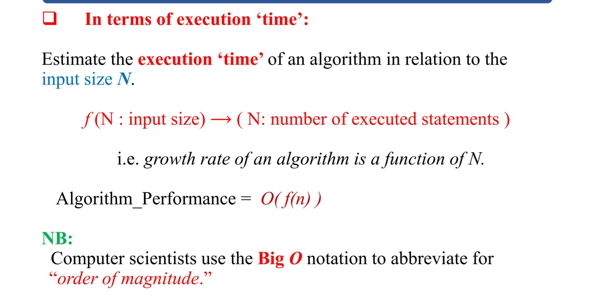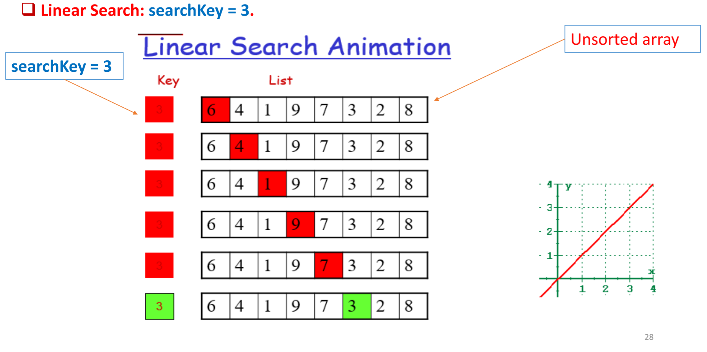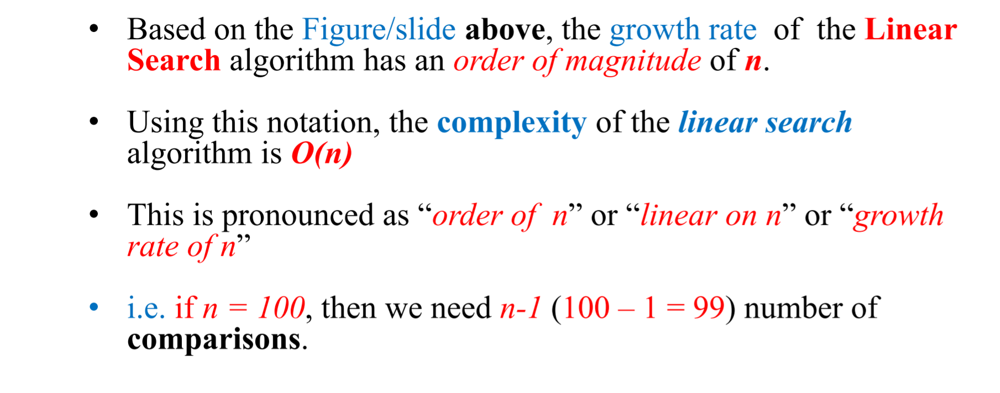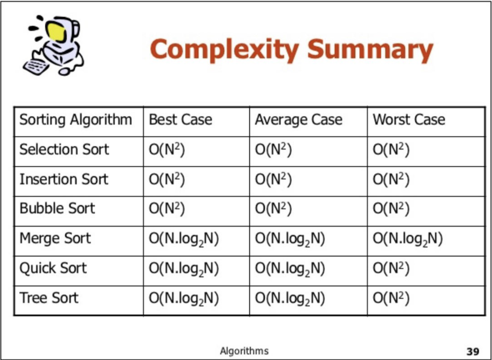
