# Heap
Stack (LIFO): insertion and deletion   
Since the insertion and deletion operations on a stack (LIFO) are made only at the end of the stack, it is more efficient to implement a stack with an
array list than a linked list.

Queue (FIFO): deletion 
Since deletions are made at the beginning of the list,  
it is more efficient to implement a queue (FIFO) using a linked list than an array list.
In the heap, the root is the object with the highest priority in the queue.

priority queue can be implemented using a heap

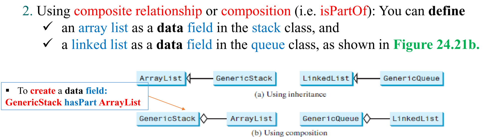
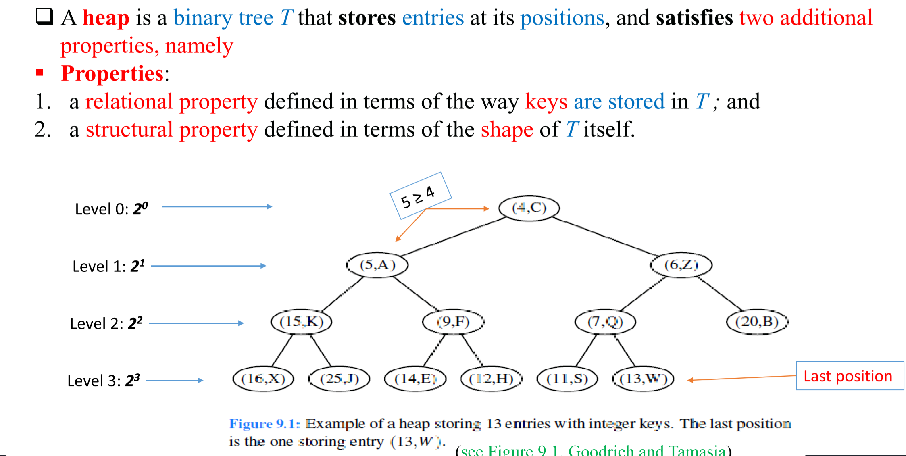
The relational property are as follows:   
 Heap-Order Property: In a heap T, for every position p other than the root (which has
no parent), the key stored at p is greater than or equal to the key stored at p’s parent.   

The Structural property:  
For efficiency, we want our heap Tto have as small a height, possibly.  We enforce this requirement by insisting that the heap T satisfy a structural property;
that, it must be complete.  
A heap T with height h is a complete binary tree if levels 0,1, 2, . . . , h−1 of T have the maximal number of nodes possible, and the remaining nodes at level h reside in the leftmost possible positions at that level.
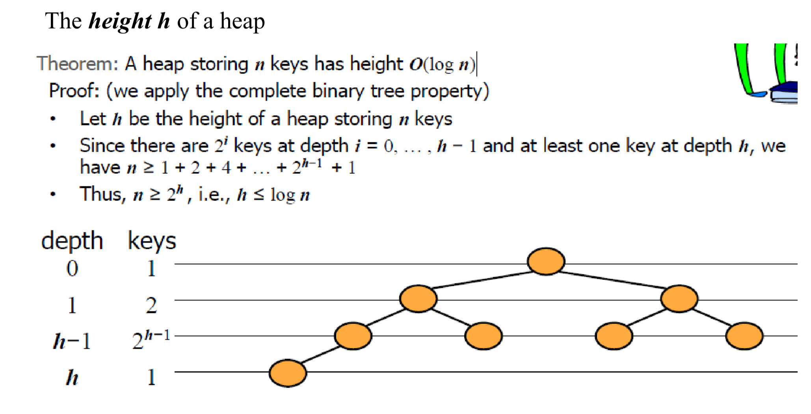
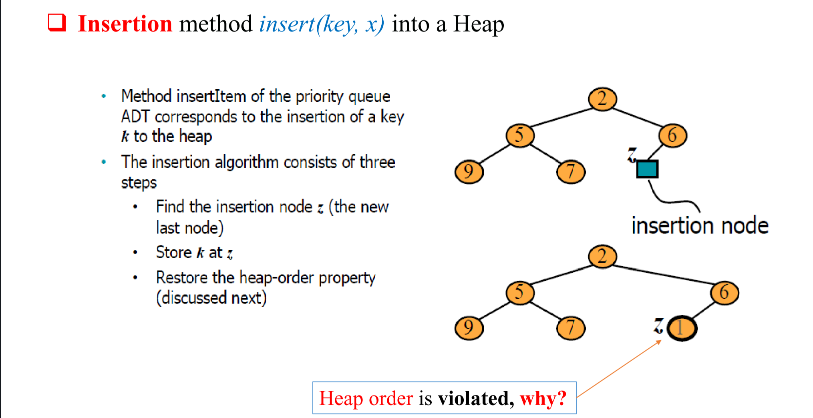
Restoring the Heap-Order Property     
(Upheap) : Big O(log n)
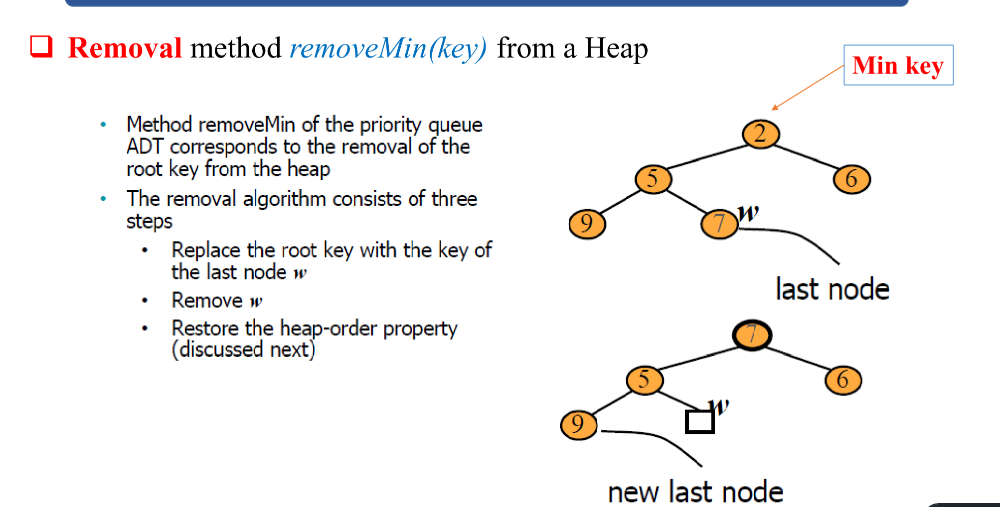
Restoring the Heap-Order Property   
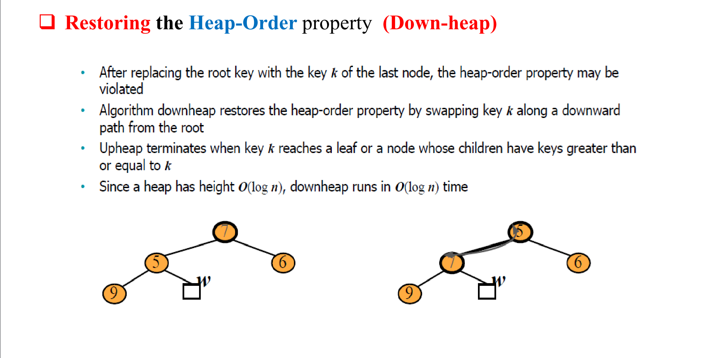
(DownHeap) : Big O(log n)
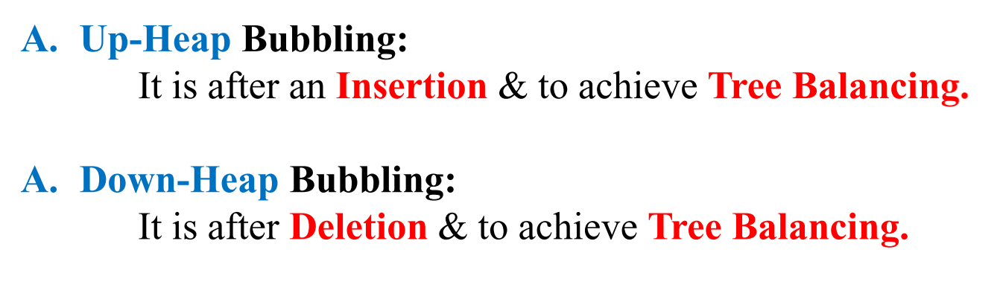
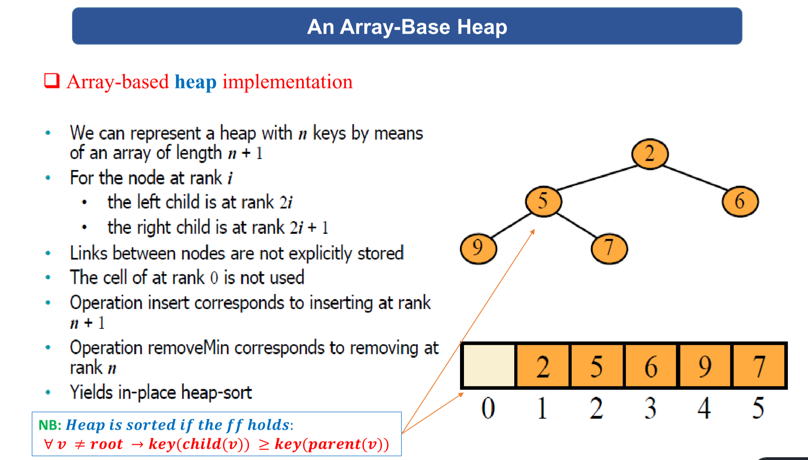  
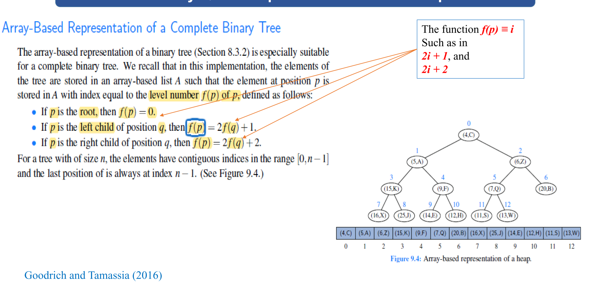
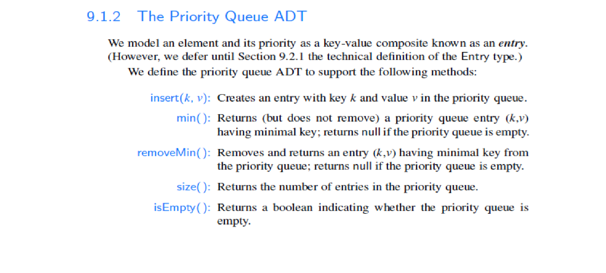
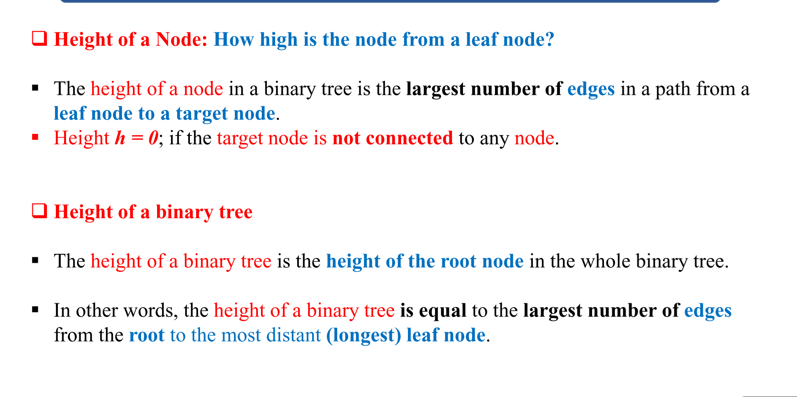
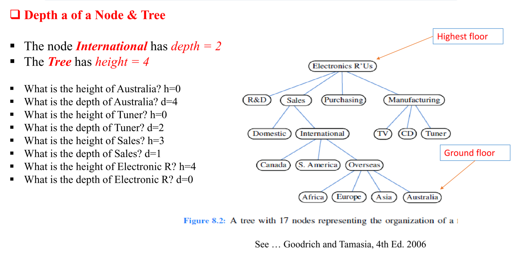
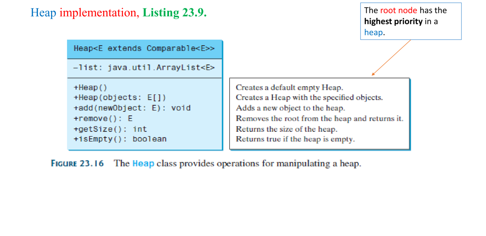
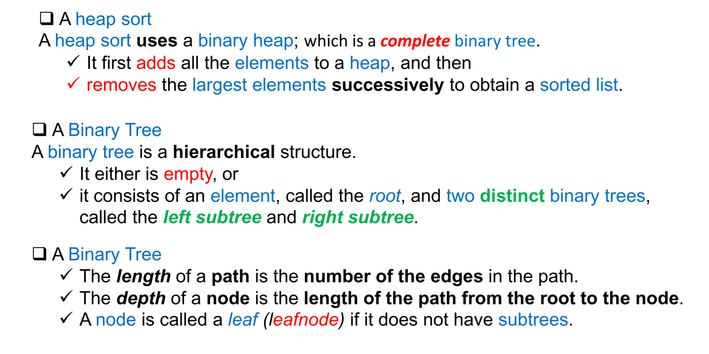
