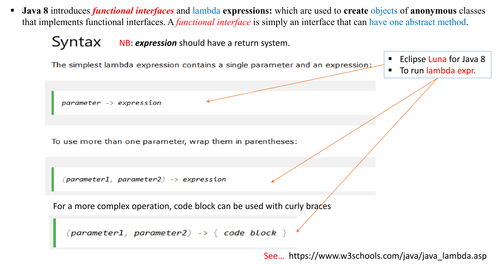

# Lambda Expresion
- Lambda expression is a way to create anonymous function i.e. functions without name.


[see this video](https://www.youtube.com/watch?v=tj5sLSFjVj4)

```java
import java.util.ArrayList;
import java.util.function.Consumer;

public class Main {
  public static void main(String[] args) {
    ArrayList<Integer> numbers = new ArrayList<Integer>();
    numbers.add(5);
    numbers.add(9);
    numbers.add(8);
    numbers.add(1);
    Consumer<Integer> method = (n) -> { System.out.println(n); };
    numbers.forEach( method );
  }
}
```