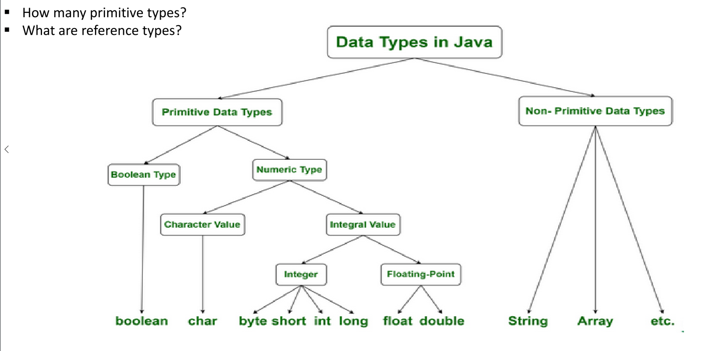
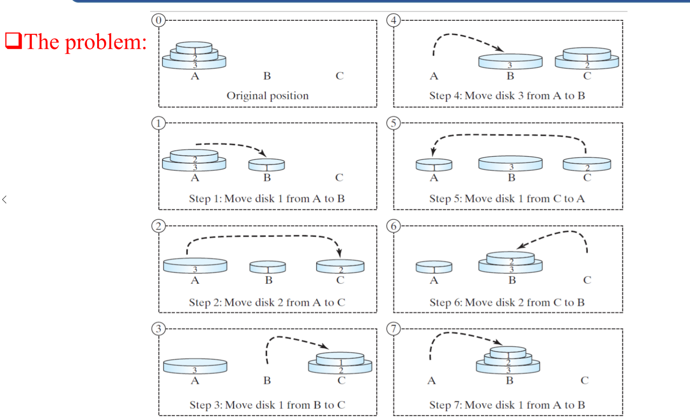

# Preparation
## Algorithms
1. finite 
2. step-by-step
3. unambiguous

## Data types

1. Cache: 
  * Level 1 cache (very fast memory): Built inside the CPU; give **instant access**, and are very **small in size** e.g. 2KB to 64KB or 1MB; hold data immediately needed by the CPU..
  * Level 2 cache (slower): Built **near the CPU** are of size of 256KB to 2MB.
2. Register: Built right in **inside the CPU** --- holds data needed by the ALU. 
2. Stack: **Static memory** allocation --- very fast access. LIFO order. 
2. Heap: Dynamic memory allocation --- store object reference. FIFO order
2. Primary (main) store e.g. _RAM_ --- holds the stacks and heaps.
6. Secondary store e.g. _ROM_ --- Hard Drives, CDs, flash drives.  

## Recursion 
All recursive methods have the following characteristics: 
* One or more `base cases` (the simplest case) are used to stop recursion.
* Every recursive call **reduces the original problem**, bringing it increasingly closer to a base case until it becomes that case.
In general, to solve a problem using recursion, you: 
1. Break it into sub-problems. 
2. If a sub-problem resembles the original problem, you can apply the same approach to solve the sub-problem recursively.  
This subproblem is almost the same as the original problem in nature
with a smaller size.

[see recursive example](../algorithmAnalysis/recursiveBS.java)


```java
public class RecursivePalindrome {
    public static boolean isPalindrome(String s){
        if(s.length()<=1)
            return true;//base case
        else if (s.charAt(0)!=s.charAt(s.length()-1))
            return false;//base case
        else
            return isPalindrome(s.substring(1,s.length()-1));//bring it closer to base case, as we are reducing the original problem
    }

    public static void main(String[] args) {
        System.out.println("is moon a palindrome "+isPalindrome("moon"));
        System.out.println("is noon a palindrome "+isPalindrome("noon"));
        System.out.println("is n a palindrome "+isPalindrome("n"));
    }
}
```

[CLICK HERE TO RUN HANOI TOWER](./Hanoi.java)

Some tips: you want to solve this problem, but start from disk 1 and then solve the next disk 2 is not divide the
problem into sub-problems. You should treat it as a whole part and dive into two sub-tasks. 

---
Q: which method is more efficient 
recursion is an alternative form of program control   
e.g. the for loop, and while loop.   
So, recursion is essentially repetition but without a iterative loop.
Recursion bears substantial overhead.
Each time the program calls a method, the system must assign space for all of the: 1) method’s local variables and 2) parameters.  
This can consume considerable memory, and requires extra time to manage the additional space.
63