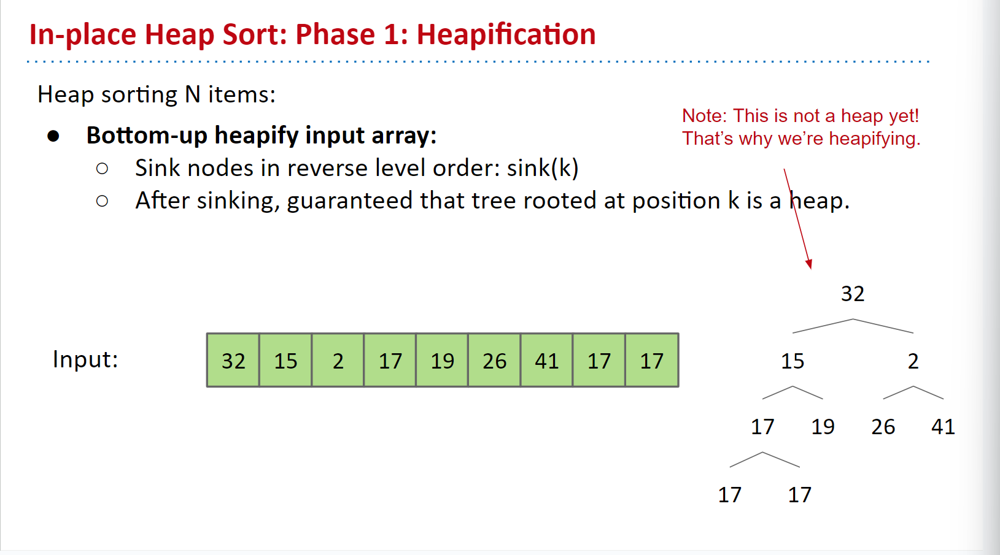
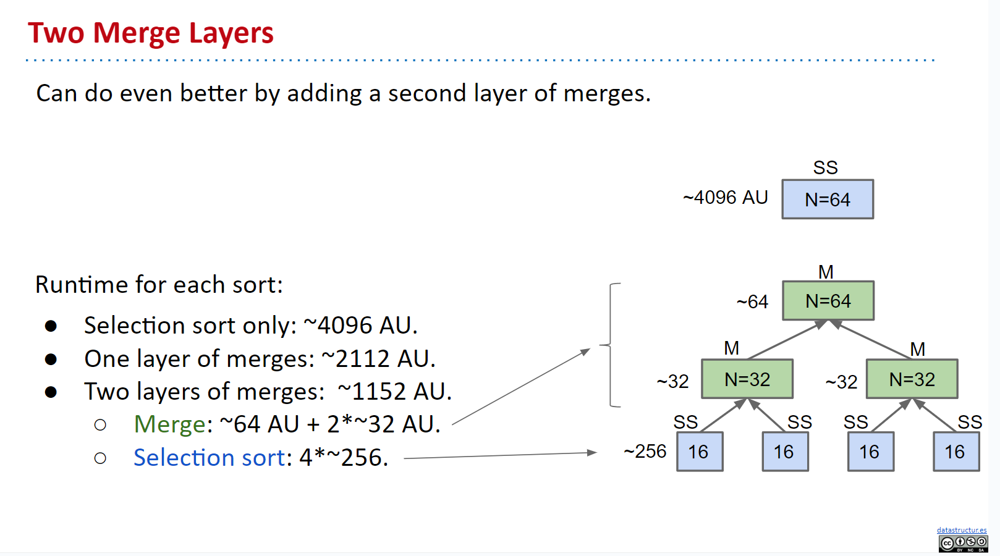

# Sorting 
## Ordering Relations in Java
In Java, **ordering relations** are typically given by the `compareTo` or `compare` methods.
```java
import java.util.Comparator;
 
public class LengthComparator implements Comparator<String> {
    public int compare(String x, String b) {
        return x.length() - b.length();
    }
}
```

how to sort is  handling the inversions in the input sequence.   
    
    1 2 3 4 can get C(4,2) = 6 inversions


## Sorting Algorithms

### [Selection Sort][ss]

```java
package sort;

public class InsertionSort {
    public static void insertionSort(int[] list) {
        long beginTime = System.nanoTime();
        int totalSteps = 0;
        for (int i = 1; i < list.length; i++) {
            int currentElement = list[i];
            int stepsTaken = 0;
            System.out.println("current min: "+currentElement);
            int j;

            for (j = i - 1; j >= 0 && list[j] > currentElement; j--) {
                list[j + 1] = list[j];
                stepsTaken++;
                System.out.println(list[j] + " in index" + " : " + j + " " + stepsTaken + " swaps");
            }
            totalSteps +=stepsTaken;

            list[j + 1] = currentElement;
        }
        long endTime = System.nanoTime();
        System.out.println("\nTime taken: "+(endTime-beginTime));
        System.out.println("Total steps: "+totalSteps);
    }
}
```

Selection sort uses the following algorithm:  

1. Find the smallest item.
1. Swap that item to the front.
1. Repeat until all items are fixed (there are no inversions). 

* Selection sort runs in `O(N^2)` time using an array or similar data structure.
*  look through the entire remaining array each time to find the minimum, examining the same items over and over.

### Heap Sort
`max heap` we can maintain a "sorted" and "unsorted" portion of the array.
runs in `O(NlogN)` time.  Then, to heapsort N items, we can insert all the items into a max heap and create and output array. Then, we repeatedly delete the largest item from the max heap and put the largest item at the end part of the output array.

* Inserting N items into the heap: O(NlogN)
* Selecting the largest item: O(1)
* Removing the largest item: O(logN)
  In terms of memory usage, the output array takes an extra space. This is worse than selection sort, which uses no extra space, but the improvement in runtime far outweighs this downside.

### In-place Heapsort

use the input array itself to form the heap and output array.
`bottom-up heapification` array into a heap
moving in reverse level order up the heap, sinking nodes to their appropriate location as you move up.  
[demo](https://docs.google.com/presentation/d/1SzcQC48OB9agStD0dFRgccU-tyjD6m3esrSC-GLxmNc/edit#slide=id.g463de7561_042)



### [Merge Sort][ms]
1. Split the items into half.
2. Mergesort each half.
3. Merge the two sorted halves to form the final result.
4. O(NlogN)  
5. `divede and conquer`
   [demo for merge](https://docs.google.com/presentation/d/1mdCppuWQfKG5JUBHAMHPgbSv326JtCi5mvjH1-6XcMw/edit#slide=id.g463de7561_042)
```java
package sort;

public class MergeSort {
    static int steps = 0;

    public static void mergeSort(int[] list) {
        //dive dive dive and dive until you can't dive anymore
        if (list.length > 1) {
            int[] firstHalf = new int[list.length / 2];
            steps++;
            System.arraycopy(list, 0, firstHalf, 0, list.length / 2);
            mergeSort(firstHalf);

            int secondHalfLength = list.length - list.length / 2;
            steps++;
            int[] secondHalf = new int[secondHalfLength];
            System.arraycopy(list, list.length / 2, secondHalf, 0, secondHalfLength);
            mergeSort(secondHalf);
            //done? then lets merge
            merge(firstHalf, secondHalf, list);
        }

    }

    public static void merge(int[] list1, int[] list2, int[] temp) {
        int current1 = 0;
        int current2 = 0;
        int current3 = 0;

        while (current1 < list1.length && current2 < list2.length) {
            if (list1[current1] < list2[current2]) {
                temp[current3++] = list1[current1++];
                steps++;//selection sorting here
            } else {
                temp[current3++] = list2[current2++];
                steps++;
            }
        }
        while (current1 < list1.length) {
            temp[current3++] = list1[current1++];//     
            steps++;
        }
        while (current2 < list2.length) {//be like: [ ] [1,2,3,4]
            temp[current3++] = list2[current2++];//[1]..[1,2]...[1,2,3]...[1,2,3,4]
            steps++;
        }
    }

    public static void main(String[] args) {
        long beginTime = System.nanoTime();
        int[] list = {2, 3, 2, 6, 5, 1, -2, 3, 17, 12};
        long endTime = System.nanoTime();
        System.out.println("Time taken: " + (endTime - beginTime));
        mergeSort(list);
        System.out.println("Sorted list:");
        for (int i = 0; i < list.length; i++) {
            System.out.print(list[i] + " ");
        }
        System.out.println("\nSteps taken: " + steps);
    }
}
```
 
merge only take O(N) time to merge two sorted halves. The total is O(NlogN) time.

### [Insertion Sort][is]

In insertion sort, we start with an empty output sequence. Then, we select an item from the input, inserting into the 
output array at the correct location.  
Note that on sorted or almost-sorted arrays, insertion sort does very little work. In fact, the number of swaps that it
does is equal to the number of inversions in the array.
In other words, on arrays with a small number of inversions, insertion sort is probably the fastest sorting algorithm. 
The runtime is O(N+k) , where k is the number of inversions in the array. If we define an almost-sorted array as one where the number 
of inversions  for some constant , then insertion sort runs in linear time.
```java
package sort;

public class InsertionSort {
    public static void insertionSort(int[] list) {
        long beginTime = System.nanoTime();
        int totalSteps = 0;
        for (int i = 1; i < list.length; i++) {
            int currentElement = list[i];
            int stepsTaken = 0;
            System.out.println("current min: "+currentElement);
            int j;
    
            for (j = i - 1; j >= 0 && list[j] > currentElement; j--) {
                list[j + 1] = list[j];
                stepsTaken++;
                System.out.println(list[j] + " in index" + " : " + j + " " + stepsTaken + " swaps");
            }
            totalSteps +=stepsTaken;

            list[j + 1] = currentElement;// this for loop is handling the inversions in the input sequence,as the k
        }
        long endTime = System.nanoTime();
        System.out.println("\nTime taken: "+(endTime-beginTime));
        System.out.println("Total steps: "+totalSteps);
    }

    public static void main(String[] args) {
        int[] list = {2, 3, 2, 6, 5, 1, -2, 3, 17, 12};
        insertionSort(list);
        System.out.println("Sorted list:");
        for (int i = 0; i < list.length; i++) {
            System.out.print(list[i] + " ");
        }
    }
}
```

## Summary 

[Overview][ref]


EXERCISES     

How many inversions are there in the array [10, 100, 60, 40, 50]?    
    
    5; the violations are 100 > 60, 100 > 40, 100 > 50, 60 > 40, and 60 > 50.  
 
 What is the space complexity of selection sort?  
 
    Θ(1). All swaps in selection sort happen in-place.  

If we are insertion sorting [5, 6, 7, 1, 8, 9, 2], how many total swaps will occur?  
 
    8; simply count the number of inversions (5 > 1, 5 > 2, 6 > 1, 6 > 2, 7 > 1, 7 > 2, 8 > 2, 9 > 2).

Which sort do you expect to run more quickly on a reversed array, selection sort or insertion sort?  
 
     Asymptotically, both selection and insertion sort run in Θ(N^2)  on a reverse-sorted array. However, note that selection sort only does N  total swaps (finding the maximum, then swapping to the  (front), while insertion sort does on the order of N^2  swaps (swapping each item to the front), so insertion sort will actually be slower by a constant factor.

---


[ALL COMES FROM CS 61B](https://cs61b-2.gitbook.io/cs61b-textbook/)

[ss]: ./SelectionSort.java
[ref]: https://cs61b-2.gitbook.io/cs61b-textbook/29.-basic-sorts/29.5-summary
[ms]:./MergeSort.java
[is]: ./InsertionSort
